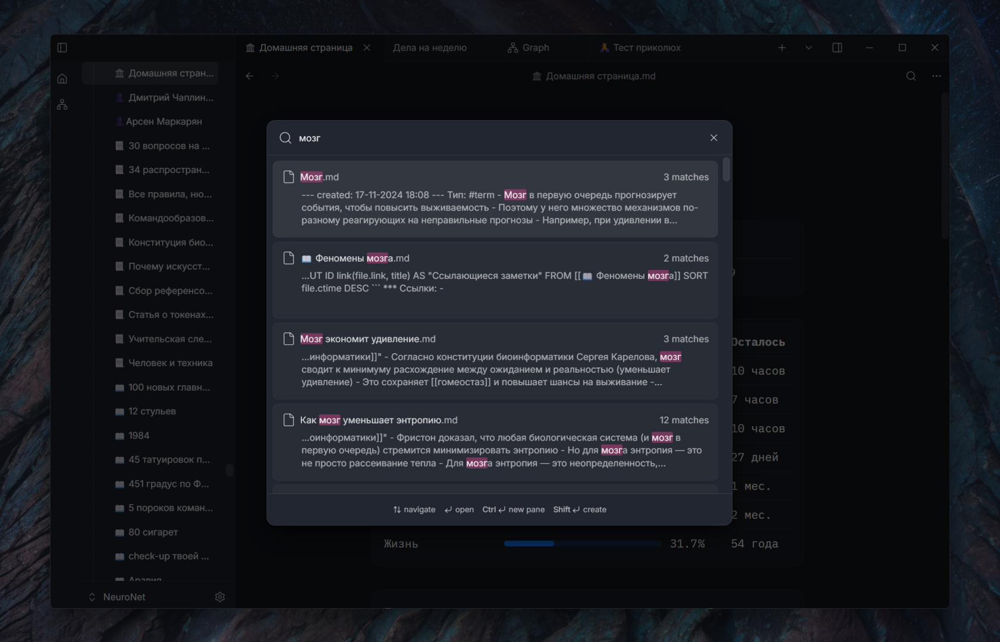
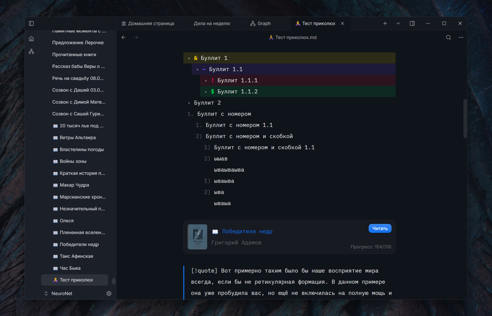
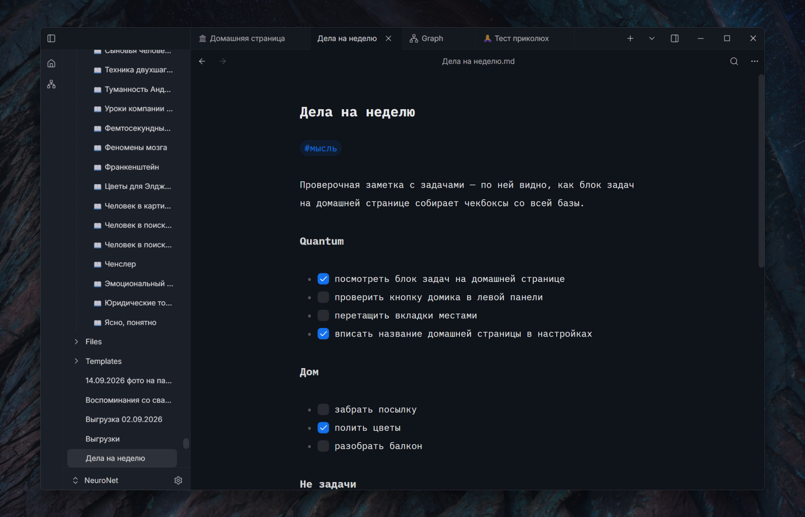
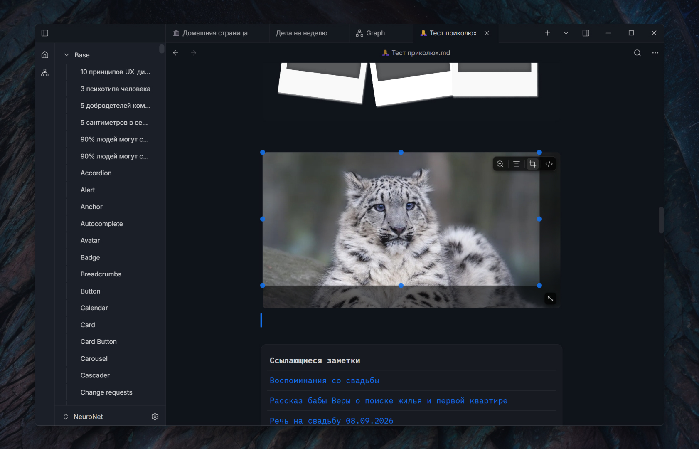
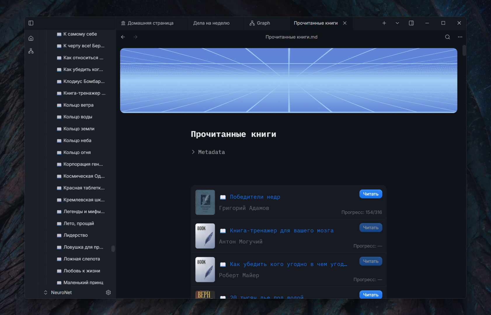
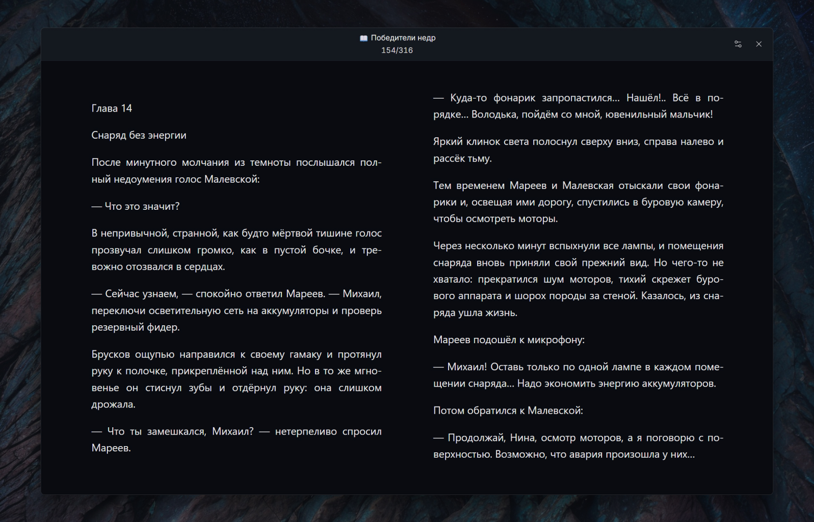

<p align="center">
  
</p>

<h1 align="center">Aquilum</h1>

<p align="center">
  Быстрая локальная база знаний для Windows.<br>
  Обычный Markdown на вашем диске, удобный редактор, мгновенный поиск, связи, запросы и встроенная читалка.
</p>

<p align="center">
  <a href="https://github.com/Freaction/Aquilum/releases/latest"><b>Скачать последнюю версию</b></a>
  · <a href="#установка">Установка</a>
  · <a href="README.md">English</a>
</p>

---

## Ваши знания остаются вашими

Aquilum открывает выбранную вами папку и напрямую работает с `.md` файлами внутри неё. Обязательного аккаунта, закрытого формата заметок и облачной базы данных нет. Заметки и вложения остаются доступными в других программах, а для резервного копирования и синхронизации можно использовать любой сервис, которому вы доверяете.

Интерфейс приложения построен на Tauri и React, а работа с диском, индексом, поиском и запросами выполняется на Rust. В результате получается быстрый рабочий инструмент, единственный источник правды которого находится на вашем компьютере.

## Знакомство с Aquilum

### 1. Возвращайтесь в то же рабочее пространство

Aquilum восстанавливает не только последний файл, но и рабочий контекст вокруг него. Вкладки можно переставлять, история переходов работает назад и вперёд, а дерево документов помогает вести несколько направлений работы, не теряя нужное место. Любую заметку можно назначить домашней страницей базы и превратить в обзорную панель, где обычный Markdown сочетается с живыми запросами `TABLE`, `LIST` и `TASK`.

Панель справа показывает историю изменений заметки и источник каждой правки. Можно открыть наглядное сравнение версий, сохранить важное состояние как именованную версию, целиком восстановить прошлую редакцию или отменить одно конкретное изменение. При этом актуальный документ по-прежнему остаётся обычным `.md` файлом на диске и доступен вне Aquilum.


### 2. Ищите по всей базе прямо во время набора

Глобальный поиск работает на локальном полнотекстовом индексе и показывает подходящие заметки ещё во время набора запроса. У каждого результата виден фрагмент окружающего текста, поэтому релевантность можно оценить до открытия документа. Перемещение по результатам с клавиатуры ускоряет разбор длинной выдачи.



Для каждой базы поддерживается отдельный индекс, который обновляется и после внешних изменений файлов. Внутри открытой заметки есть отдельный поиск с подсветкой совпадений. Aquilum также индексирует типизированные поля frontmatter, чтобы живые запросы могли отбирать материалы по структурированным данным, а не только по словам.

### 3. Исследуйте связи на графе знаний

Граф превращает вики-ссылки между заметками в интерактивную карту базы. По нему можно перемещаться и масштабировать обзор, выбирать узел, подсвечивать его окружение и открывать связанную заметку прямо из визуализации. Настройки расстояния между узлами, их размера, подписей, цветов и диапазона дат помогают убрать лишний шум в большой базе.

Граф дополняет обратные и исходящие ссылки и рекомендации связанных заметок. Поэтому он полезен и как общий обзор, и как способ ответить на конкретные вопросы: какие материалы поддерживают текущую мысль, куда она ведёт и какие близкие идеи ещё не соединены явной ссылкой.


### 4. Пишите в Markdown с живым предпросмотром

Редактор на CodeMirror показывает заголовки, выделение, ссылки, списки, callout-блоки, код и встроенное содержимое почти так же, как они будут выглядеть при чтении. Служебные маркеры скрываются только там, где это улучшает читаемость, и снова появляются, когда курсор входит в соответствующую конструкцию. Оглавление помогает перемещаться по длинным документам, а автодополнение ссылок — связывать текущий текст с уже существующими заметками.

Источником остаётся переносимый Markdown на диске. Вложенные списки, оба варианта нумерации, пустые пункты, задачи, блоки кода, frontmatter и вики-ссылки хранятся как текст, а не превращаются в закрытый формат. Обложки страниц и книжные callout-блоки добавляют выразительное оформление, не меняя эту модель владения данными.



### 5. Управляйте задачами без отдельной базы задач

Задачи остаются обычными Markdown-чекбоксами внутри заметок, к которым относятся, но работают как интерактивные элементы редактора. Пункт можно завершить прямо в тексте, сохранив рядом контекст проекта, а метаданные использовать для разделения направлений, статусов и дат без копирования задач в другую систему.

Живой запрос `TASK` собирает подходящие пункты из разных заметок в единую сводку. Если отметить задачу выполненной в результате запроса, Aquilum обновит её в исходной заметке — сводка и проектный документ не расходятся.



### 6. Редактируйте таблицы визуально

Таблицы остаются читаемой Markdown-разметкой, но получают привычные операции для работы со структурой. Можно менять ширину столбцов, выделять прямоугольный диапазон, объединять ячейки, перемещать строки и колонки визуальными средствами, не исправляя вручную разделители после каждого действия. Навигация с клавиатуры ускоряет заполнение больших таблиц.

Визуальная сетка и Markdown-источник синхронизируются между собой. Таблицу по-прежнему можно читать, сравнивать и хранить как текст, а Aquilum берёт на себя наиболее хрупкие структурные преобразования.


### 7. Храните медиа, ссылки и контекст вместе

Вставьте изображение из буфера или импортируйте изображение либо видео — Aquilum сохранит файл как локальное вложение внутри базы. Картинку можно кадрировать прямо в редакторе, не переключаясь в отдельную программу для подготовки схемы, скана или иллюстрации. PDF и другие источники можно хранить рядом с заметками, в которых вы их разбираете.

Панели под документом показывают контекст в обе стороны: исходящие ссылки — на что ссылается заметка, обратные — какие материалы ссылаются на неё. Рекомендации связанных заметок помогают обнаружить близкий материал ещё до создания явной ссылки. Так заметка становится рабочей исследовательской поверхностью, а не изолированной страницей.



### 8. Соберите локальную библиотеку книг

Добавляйте EPUB, MOBI, AZW3 и FB2, не перенося чтение в отдельный облачный сервис. Библиотека показывает обложки, авторов, форматы и прогресс в одном месте, а исходные файлы книг остаются внутри базы. При повторном открытии Aquilum возвращает сохранённую позицию, поэтому библиотека подходит и для справочников, и для последовательного чтения больших произведений.



### 9. Читайте и сохраняйте цитаты внутри базы

Встроенная читалка предлагает спокойную двухколоночную вёрстку и настройки гарнитуры, размера текста, межстрочного интервала, ширины колонки, выравнивания и переносов. Позиция и процент прочитанного синхронизируются с библиотекой, поэтому закрытие книги не сбрасывает прогресс.

Выделенный фрагмент можно сохранить цитатой в связанную книжную заметку. После этого цитата становится обычной частью базы знаний: её можно комментировать, связывать с идеями и проектами, находить через поиск и включать в запросы.



### 10. Переиспользуйте структуру через шаблоны и метаданные

Шаблоны превращают повторяющуюся структуру заметок в воспроизводимый процесс. Нужный шаблон можно найти поиском, применить к открытому документу или сразу создать на его основе новый; значения даты и времени подставляются в момент применения. Начальные шаблоны подходят для обычных и книжных заметок, а собственные можно сделать для встреч, источников, людей, проектов и любых других повторяющихся сущностей.

На примере книги видно, как YAML frontmatter представлен редактируемыми полями: обложка, автор, статус, даты, оценка, теги и исходный файл остаются структурированными и доступными для поиска. Метаданные продолжают храниться прямо в Markdown, поэтому их читают другие инструменты и сразу используют запросы Aquilum.


### 11. Настройте интерфейс под свой способ работы

Настройки оформления относятся ко всему рабочему пространству, а не только к теме редактора. Можно выбрать светлый или тёмный режим, язык интерфейса, акцентный цвет, масштаб, шрифты редактора и читалки, межстрочный интервал и ширину текста. Домашняя заметка тоже выбирается в настройках, а параметры чтения отделены от письма — плотное исследовательское пространство и спокойная книжная вёрстка не обязаны выглядеть одинаково.


### 12. Восстанавливайте удалённые заметки и папки

Удаление не стирает материал немедленно. Заметки и целые папки перемещаются в корзину Aquilum, где видно удалённое содержимое и можно вернуть его на прежнее место. Срок хранения настраивается, чтобы найти баланс между безопасностью и размером базы.

Корзина — один из уровней общей системы восстановления. История защищает от нежелательных правок внутри заметки, а отслеживание внешних изменений сохраняет работу из другого редактора или от ИИ-агента. Если конкурирующие изменения нельзя однозначно объединить, Aquilum создаёт конфликтную копию вместо скрытой потери текста.


## Возможности

### Текст и организация

- Редактор на CodeMirror с живым предпросмотром Markdown и оглавлением документа.
- Вкладки с перетаскиванием, восстановление рабочей сессии и история переходов назад и вперёд.
- Дерево файлов с созданием папок, переименованием, перемещением, дублированием и безопасным удалением заметок.
- YAML frontmatter в виде редактируемых полей и быстрая вставка заготовки метаданных.
- Поиск по шаблонам, применение шаблона к открытой заметке или создание новой, подстановка даты и времени и стартовые шаблоны заметки и книги.
- Вставка изображений и видео из буфера или файла, локальное хранение вложений и кадрирование изображений прямо в редакторе.
- Несколько независимых хранилищ, каждое со своим индексом.
- История заметок с авторами изменений, просмотром различий, именованными версиями, восстановлением целой версии и отменой отдельного изменения.
- Корзина с настраиваемым сроком хранения и восстановлением заметок и папок на прежнее место.
- Отслеживание внешних изменений с безопасным слиянием и конфликтной копией, если однозначное слияние невозможно.

### Поиск и исследование

- Полнотекстовый поиск по базе на Tantivy с результатами во время набора.
- Поиск по текущей заметке с подсветкой совпадений.
- Типизированные метаданные в индексе для быстрых структурированных выборок.
- Обратные и исходящие ссылки, навигация по графу и рекомендации связанных заметок.
- Анализ источников с поиском материалов Wikipedia, выбором кандидатов и сохранением результата в заметку.
- Горячие клавиши для создания заметок, глобального поиска, навигации по результатам и открытия в новой панели.

### Локальная работа с ИИ-агентами

Aquilum предоставляет опциональный локальный MCP-сервер. Совместимые ИИ-инструменты могут искать и читать материалы, создавать и точечно редактировать заметки, работать со ссылками, метаданными, историей версий и корзиной. Агент может обращаться к другой подключённой базе в фоне, не переключая активное окно и вкладки пользователя. Документы используют CRDT-модель Yjs: изменения применяются небольшими правками вместо полной перезаписи, поэтому ваш ввод и работа агента безопасно сливаются. Надёжным источником правды остаётся Markdown-файл на диске.

### Экспорт и переносимость

- Экспорт заметки в A4 PDF с её отрисованным оформлением.
- Обычные Markdown-файлы и вложения в обычных папках.
- Совместимость с вашим способом резервного копирования, контроля версий или синхронизации.

## Установка

1. Откройте [последний релиз](https://github.com/Freaction/Aquilum/releases/latest).
2. Скачайте `aquilum-app_<версия>_x64-setup.exe`.
3. Запустите установщик и выберите новую или уже существующую папку для базы.

Aquilum устанавливается для текущего пользователя и не требует прав администратора. Сейчас установщик не подписан сертификатом подписи кода Windows, поэтому SmartScreen может показать предупреждение. Если файл скачан из этого репозитория, выберите **Подробнее → Выполнить в любом случае**.

### macOS (Apple Silicon и Intel)

Скачайте `.dmg` из [последнего релиза](https://github.com/Freaction/Aquilum/releases/latest) или установите приложение одной командой в Терминале:

```sh
curl -fsSL https://raw.githubusercontent.com/Freaction/Aquilum/main/scripts/install.sh | bash
```

Удалить приложение можно так:

```sh
curl -fsSL https://raw.githubusercontent.com/Freaction/Aquilum/main/scripts/uninstall.sh | bash
```

Скрипт удаления убирает `Aquilum.app` из `~/Applications`. Папки баз, Markdown-файлы и настройки приложения остаются нетронутыми.

### Linux (Ubuntu 24, x86_64)

Скачайте пакет `.deb` или AppImage из [последнего релиза](https://github.com/Freaction/Aquilum/releases/latest).

## Обновления

При запуске Aquilum проверяет обновления в этом публичном репозитории. Если доступна новая версия, приложение может скачать её, показать прогресс, проверить подпись пакета, установить обновление и перезапуститься. Без подключения к сети Aquilum запускается как обычно, а локальная база остаётся доступной.

## Требования

- 64-разрядная Windows 10 или Windows 11.
- Microsoft Edge WebView2. Обычно он уже есть в Windows; при необходимости установщик может его загрузить.
- macOS на Apple Silicon (arm64) или Intel (x86_64).
- Ubuntu 22.04 или новее, x86_64.

## Конфиденциальность и хранение данных

Ваши материалы остаются на вашем компьютере:

- заметки — `.md` файлы в выбранной папке базы;
- вложения и книги находятся в этой же базе;
- настройки, состояние окна, поисковые индексы и другие восстанавливаемые служебные данные находятся в каталоге данных Aquilum.

Aquilum не требует облачного аккаунта. Сеть используется для проверки обновлений и, только при явно запущенном анализе источников, для получения материалов Wikipedia. Опциональный MCP-сервер работает локально и запускается только после включения.

## Обратная связь

Сообщайте об ошибках и предлагайте улучшения во вкладке [Issues](https://github.com/Freaction/Aquilum/issues). Укажите версию из раздела **Настройки → Система → О программе**, ожидаемое и фактическое поведение, а также шаги для воспроизведения. Скриншоты и небольшая тестовая база помогут, если в них нет личных данных.

## Исходный код и лицензия

В этом репозитории лежат исходники Aquilum, установщики для Windows, манифесты обновлений и скриншоты. Как собрать — в [DEVELOPMENT.md](DEVELOPMENT.md) и [aquilum-app/README.md](aquilum-app/README.md), устройство приложения — в [knowledge base](knowledge%20base).

Copyright © 2026 Dmitriy Chaplinskiy.

Aquilum — свободная программа под лицензией [GNU Affero General Public License v3.0 only](LICENSE). Её можно использовать, изучать, изменять и распространять, но любая распространяемая версия, а также изменённая версия, доступная пользователям по сети, должна выходить под той же лицензией вместе с полным исходным кодом. Для использования на других условиях, например по коммерческой лицензии, свяжитесь с автором.

Название «Aquilum» и логотип обозначают оригинальный проект и не передаются по лицензии изменённым версиям.
